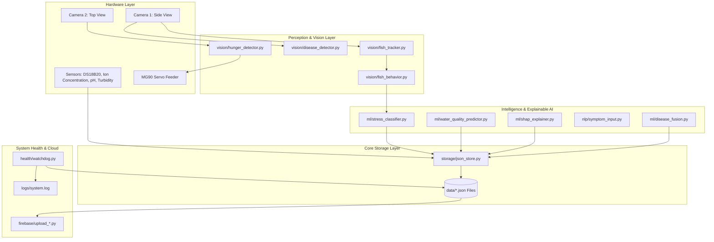

# Smart Aquarium Monitoring System (Raspberry Pi 4B)

Academic and research-grade continuous Smart Aquarium Monitoring System powered by **Computer Vision (YOLOv8)**, **Machine Learning**, **Explainable AI (SHAP)**, **NLP symptom processing**, and **Firebase Realtime Database** synchronization.

---

## 1. System Overview & Architecture

The system is designed for **24/7 continuous continuous operation** on a **Raspberry Pi 4B (2GB RAM)**. It avoids giant monolithic scripts by adhering strictly to a **decoupled, modular micro-task architecture** where modules perform a single responsibility and communicate exclusively via JSON data files (`storage/json_store.py`) or return values passed by the orchestrator (`master.py`).

### System Data Flow Architecture



---

## 2. Hardware Allocation & Camera Routing

- **Device**: Raspberry Pi 4B (2GB RAM)
- **Camera 1 (Side View)**: Dedicated exclusively to:
  - Fish Detection (YOLOv8)
  - Fish Tracking & Trajectory History (up to 4 fish)
  - Behavioral Analysis (Bottom/Surface dwelling, Freezing, Erratic swimming)
  - Side-view Disease Detection (TFLite 4-thread execution)
- **Camera 2 (Top View)**: Dedicated exclusively to:
  - Hungry Fish Detection near the surface feeding zone
  - Fish counting during feeding cycles
  - MG90 Micro Servo feeder trigger control
  - *Rule*: Camera 2 is **never** used for stress analysis.

---

## 3. Module Structure & File Hierarchy

```
smart_aquarium/
├── master.py                       # 24/7 Main scheduler orchestrator
├── config.py                       # Centralized configuration single source of truth
├── requirements.txt                # Pi 4B (2GB RAM) optimized dependency manifest
├── README.md                       # Comprehensive system documentation
│
├── utils/
│   ├── logger.py                   # Structured logger writing to logs/system.log
│   ├── scheduler.py                # Periodic task execution scheduler helper
│   └── firebase.py                 # Firebase SDK initialization bridge
│
├── storage/
│   └── json_store.py               # Thread-safe atomic JSON persistence helper
│
├── health/
│   └── watchdog.py                 # Task monitoring context manager & health tracker
│
├── sensors/
│   ├── base_sensor.py              # Extensible abstract base class for future sensors
│   ├── ds18b20_reader.py           # DS18B20 1-Wire temperature reader
│   ├── ionconcentration_reader.py  # RS485 Modbus Ion Concentration reader
│   ├── ph_reader.py                # pH UART/serial reader
│   └── turbidity_reader.py         # Turbidity ADC channel reader
│
├── vision/
│   ├── side_camera.py              # Camera 1 (Side View) single-owner capture stream
│   ├── top_camera.py               # Camera 2 (Top View) independent capture stream
│   ├── fish_tracker.py             # YOLOv8 fish tracker with trajectory & speed
│   ├── fish_behavior.py            # Behavioral metrics analyzer
│   ├── disease_detector.py         # TFLite side-view disease classifier (4 threads)
│   └── hunger_detector.py          # Top-camera hunger detection
│
├── ml/
│   ├── stress_classifier.py        # Multi-factor stress classifier (Healthy to Critical)
│   ├── water_quality_predictor.py  # ML-based Water Quality Index predictor
│   ├── shap_explainer.py           # Explainable AI (SHAP) contribution percentage generator
│   └── disease_fusion.py           # Fuses vision detection + NLP symptoms
│
├── nlp/
│   └── symptom_input.py            # Parses natural language text into disease probabilities
│
├── dashboard/
│   ├── __init__.py
│   ├── app.py                      # Flask web dashboard server (daemon thread)
│   ├── commands.py                 # Thread-safe manual feed command bus
│   ├── frame_buffer.py             # Thread-safe multi-camera MJPEG frame buffer
│   └── templates/
│       └── index.html              # Dark-mode dashboard with video, sensors, SHAP, feeder UI
├── feeding/
│   └── servo.py                    # MG90 Micro Servo feeder actuation
│
├── firebase/
│   ├── client.py                   # Network upload bridge
│   ├── upload_sensor_data.py       # Uploads latest_sensor.json
│   ├── upload_behavior.py          # Uploads latest_behavior.json & latest_stress.json
│   ├── upload_water_quality.py    # Uploads latest_water_quality.json & latest_shap.json
│   └── upload_disease.py          # Uploads latest_disease.json
│
├── data/                           # Atomic JSON state store directory
│   ├── latest_sensor.json
│   ├── latest_behavior.json
│   ├── latest_stress.json
│   ├── latest_water_quality.json
│   ├── latest_shap.json
│   ├── latest_disease.json
│   ├── latest_hunger.json
│   └── watchdog.json
│
├── logs/
│   └── system.log                  # Central system execution log
│
└── models/                         # Trained model artifacts directory
    ├── vision/fish_detector_yolov8.pt
    ├── disease/fish_disease_model.tflite
    └── water_quality/rfr_model.pkl
```

---

## 4. Master Task Schedule

`master.py` coordinates background task execution using a non-blocking `ThreadPoolExecutor`.

| Interval | Task | Operations | Output JSON |
| :--- | :--- | :--- | :--- |
| **1 sec** | `sensor` | Read Arduino UART (temp/pH/turbidity) & USB Modbus (ion concentration) -> Track fish -> Analyze behavior -> Classify stress -> Firebase sync | `latest_sensor.json`<br>`latest_behavior.json`<br>`latest_stress.json` |
| **1 sec** | `manual_feed` | Consume pending manual feed commands from web dashboard -> Actuate servo | `latest_feed.json` |
| **2 sec** | `top_stream` | Refresh top camera frame buffer for dashboard video stream | Frame buffer |
| **5 sec** | `disease` | Side-camera disease detection -> Fuse visual + NLP evidence -> Firebase sync | `latest_disease.json` |
| **10 sec** | `watchdog` | Audit task runtimes, restart counts, exceptions, and status | `watchdog.json` |
| **30 sec** | `hunger` | Top-camera hunger detection -> MG90 Servo feeder actuation -> Firebase sync | `latest_hunger.json`<br>`latest_feed.json` |
| **300 sec** | `water_quality` | Predict Water Quality Index -> Compute SHAP feature contributions -> Firebase sync | `latest_water_quality.json`<br>`latest_shap.json` |


---

## 5. Raspberry Pi 4B (2GB RAM) Performance Optimizations

1. **Lazy Model Loading**: YOLOv8 and TFLite models are loaded into memory once on first demand and reused across cycles.
2. **Resource Sharing**: Camera 1 open capture stream is shared across tracking, behavior, and disease detection to prevent duplicate OpenCV handle allocations.
3. **Multi-Thread TFLite Inference**: `disease_detector.py` allocates 4 CPU threads explicitly for Raspberry Pi 4B quad-core hardware acceleration.
4. **Memory Management**: Models use lightweight feature vectors without duplicating large NumPy buffers.
5. **Fault Tolerance**: Every task runs inside `WATCHDOG.monitor("task_name")`. Unhandled hardware exceptions log errors to `logs/system.log`, record failure counts in `watchdog.json`, and allow remaining modules to continue uninterrupted.

---

## 6. Installation & Deployment Guide

### Prerequisites
On Raspberry Pi OS (64-bit recommended):
```bash
sudo apt-get update
sudo apt-get install -y python3-pip python3-opencv libatlas-base-dev
```

### Environment Setup
```bash
git clone <repository-url>
cd smart_aquarium
python3 -m venv venv
source venv/bin/activate
pip install -r requirements.txt
```

### Model Artifact Placement
Ensure pre-trained model files are placed in their respective `models/` directories:
- `models/vision/fish_detector_yolov8.pt`
- `models/disease/fish_disease_model.tflite`
- `models/disease/class_names.json`
- `models/water_quality/rfr_model.pkl` & `scaler.pkl`

### Running the System
Start the master service in the foreground:
```bash
python3 master.py
```

To run continuously as a 24/7 background system service (`systemd`):
```ini
# /etc/systemd/system/aquarium.service
[Unit]
Description=Smart Aquarium Monitoring Service
After=network.target

[Service]
Type=simple
User=pi
WorkingDirectory=/home/pi/smart_aquarium
ExecStart=/home/pi/smart_aquarium/venv/bin/python3 master.py
Restart=always
RestartSec=5

[Install]
WantedBy=multi-user.target
```

Enable and start systemd service:
```bash
sudo systemctl enable aquarium.service
sudo systemctl start aquarium.service
```

---

## 7. Modular Testing & Verification

Every module can be imported and tested independently without launching `master.py`:

```python
# Test Arduino Serial reader
from sensors.arduino_reader import read
print(read())

# Test Ion Concentration Modbus reader
from sensors.ionconcentration_reader import read as read_ion
print(read_ion())

# Test Water Quality predictor
from ml.water_quality_predictor import WaterQualityPredictor
predictor = WaterQualityPredictor()
print(predictor.predict({"ph": 7.1, "ionconcentration": 250, "temp": 25.8, "turbidity": 150}))

# Test Feeder Servo calculation
from feeding.servo import FeederServo
servo = FeederServo()
print(servo.dispense(hungry_count=2))  # Returns angle 35°
```

---

## 8. Web Dashboard & Live Video Stream

The system includes an integrated, zero-copy Flask Web UI that runs as a daemon thread in `master.py` on port `5000`:

- **URL**: `http://<Pi-LAN-IP>:5000`
- **Features**:
  - **Live Video Feed**: Low-latency MJPEG stream with interactive **Side Camera** / **Top Camera** tab switcher.
  - **Sensors Grid**: Live Temperature, pH, Turbidity, and Ion Concentration values.
  - **Water Quality & SHAP**: Real-time Water Quality Index label, water change timer estimate, and SHAP feature percentage bars.
  - **Fish Stress**: Real-time stress score, risk category, and primary stressor identification.
  - **Automatic Feeder Card**: Shows last fed time, hungry fish count, daily feeding tally, and an interactive **Dispense Food Portion** button.

### Web API Endpoints

- `GET /video_feed/<camera>` — MJPEG live stream (`side` or `top`)
- `GET /api/sensors` — Latest sensor data
- `GET /api/behavior` — Fish tracking and behavior metrics
- `GET /api/stress` — Tank and individual fish stress scores
- `GET /api/water_quality` — WQI prediction and SHAP explanation breakdown
- `GET /api/feeder` — Hunger level, feeding history, and daily count
- `POST /api/feed` — Trigger a manual food portion dispense
- `GET /api/system` — Uptime and camera stream health status

